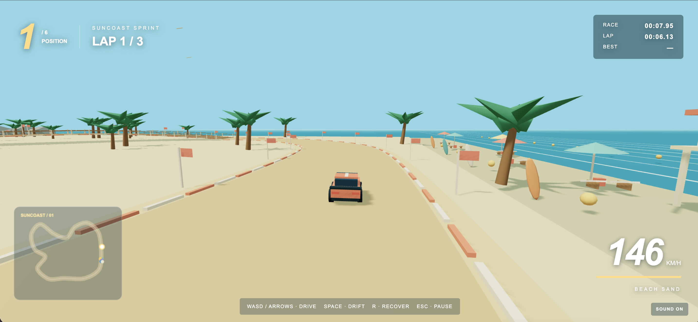
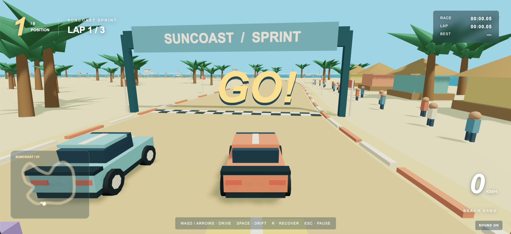

# Beach Racing Game

### Suncoast Sprint

A complete desktop-browser tropical arcade racer made with Three.js, TypeScript and Vite. All scenery, cars, particles and sound are generated locally; no external art, fonts or audio services are required.

link for the Game: https://beach-racing-game.vercel.app/ 

## Screenshots





## Play

Double-click **Play Game.command**, then open the local address printed in Terminal. Keep that Terminal window running while playing. Alternatively:

```sh
npm install
npm run dev
```

Open http://127.0.0.1:5173 in a desktop browser with WebGL 2 support.

- **W / Up:** accelerate
- **S / Down:** brake, then reverse
- **A / D or Left / Right:** steer
- **Space:** handbrake drift (brief taps work best)
- **R:** recover to the last validated section
- **Escape:** pause / resume
- **Sound button:** mute / unmute

Brake before the tight rocky turns, release the brake as you turn, then accelerate out. The wooden boardwalk has more grip than the sand. A race lasts about two minutes. The player has a higher top speed than the rivals, but corner exits matter more than holding full throttle.

## Features

One closed circuit, six cars, three laps, twelve ordered checkpoints, live standings, lap timing, minimap, countdown, restart, pause, finish results, chase camera, generated engine/ocean/skid/impact sounds, sand trails, animated sea, beach festival, palms, umbrellas, lifeguard stations, boats and an elevated boardwalk. Rivals use the same integration and collision model as the player, with individual lanes, corner braking and traffic avoidance. No teleporting or extreme rubber-banding.

## Build

`npm run build` checks TypeScript and creates `dist/`. `npm run preview` serves that production build locally. Opening index.html directly is unsupported because browser modules need an HTTP server.

## Verification

See TESTING.md for the completed test runs and development-only controls. The project is designed for keyboard play on desktop, not touch devices. Audio starts after the Play button is clicked. Lost window focus pauses the race.
